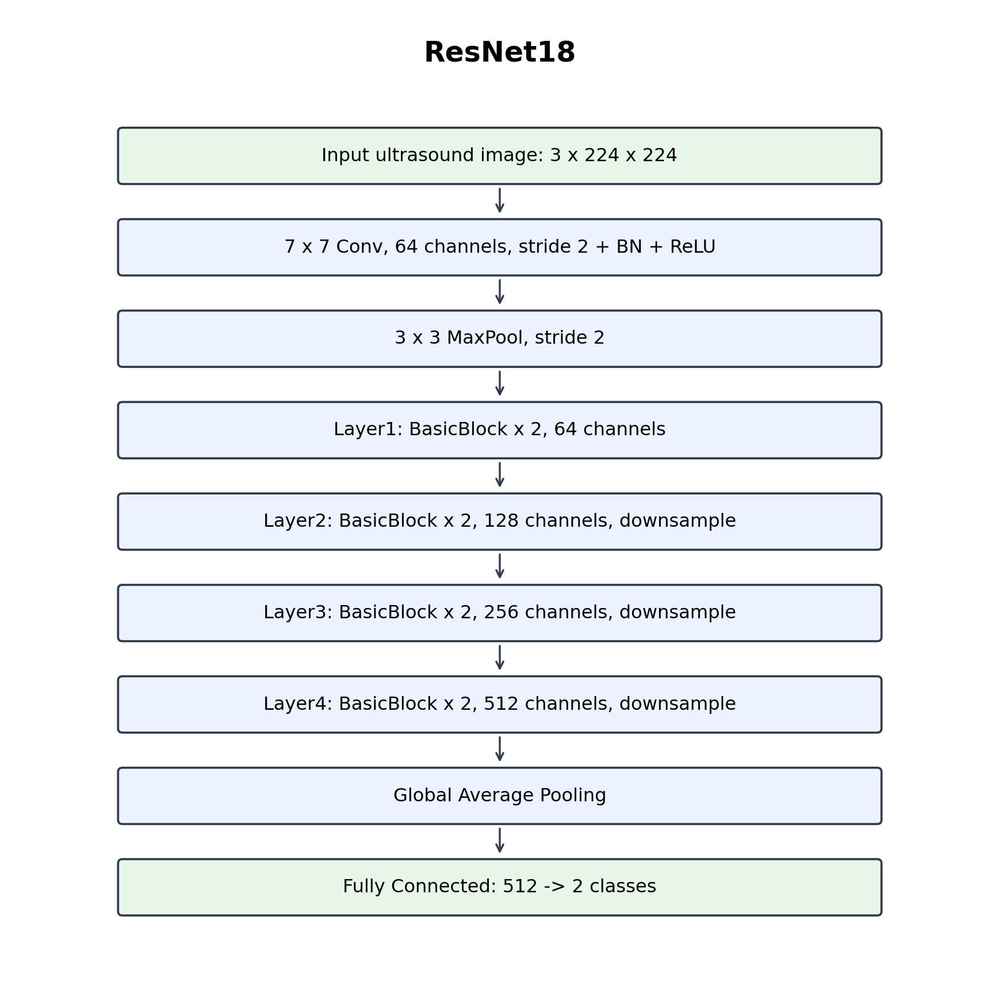
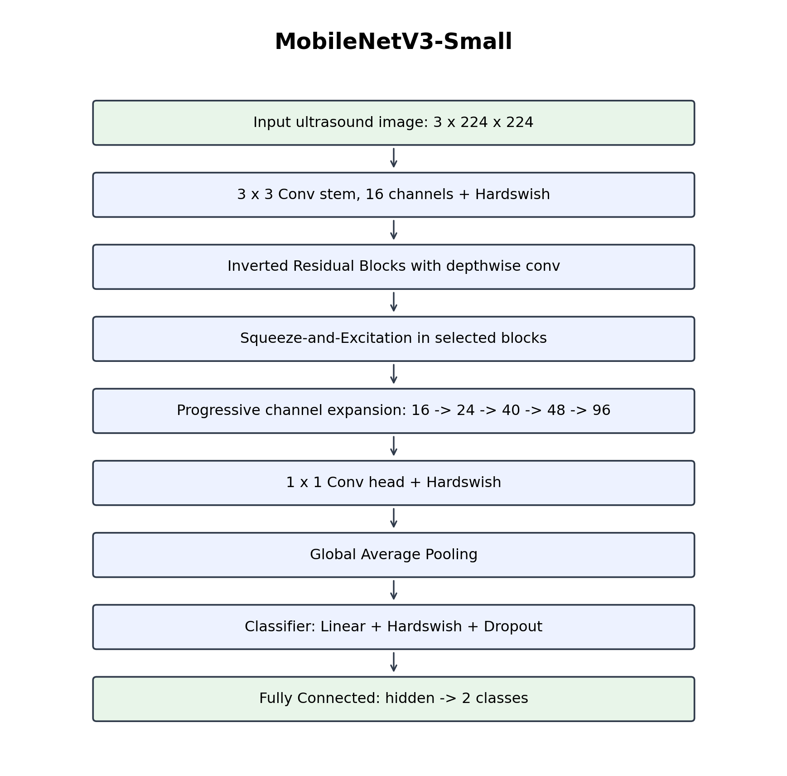
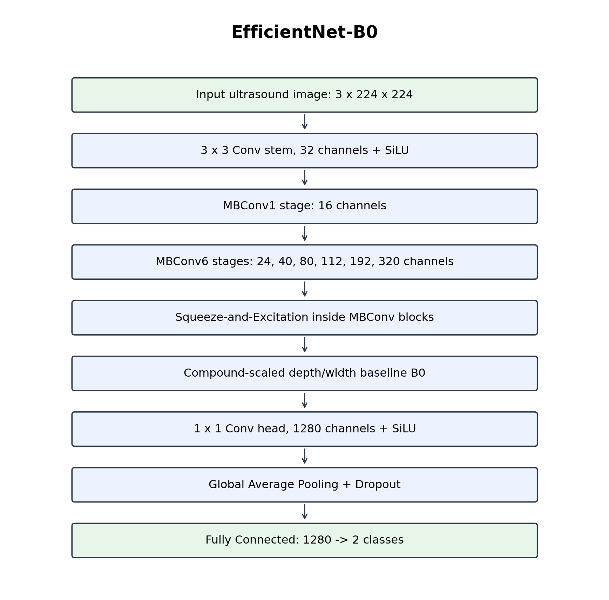
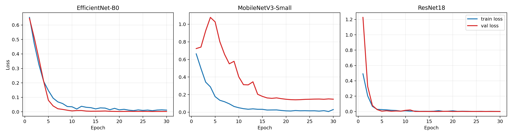
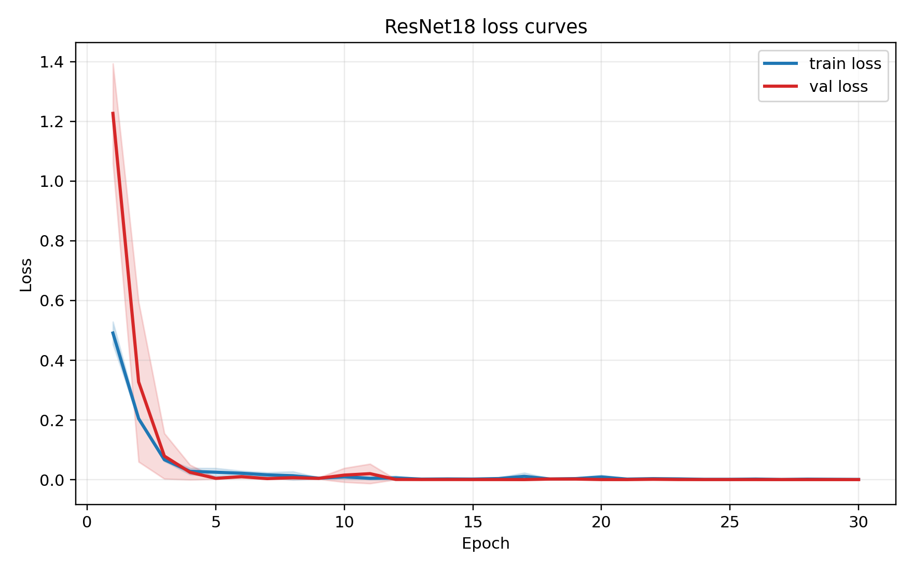
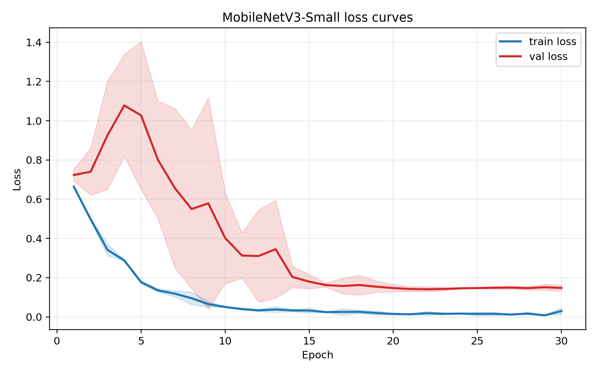
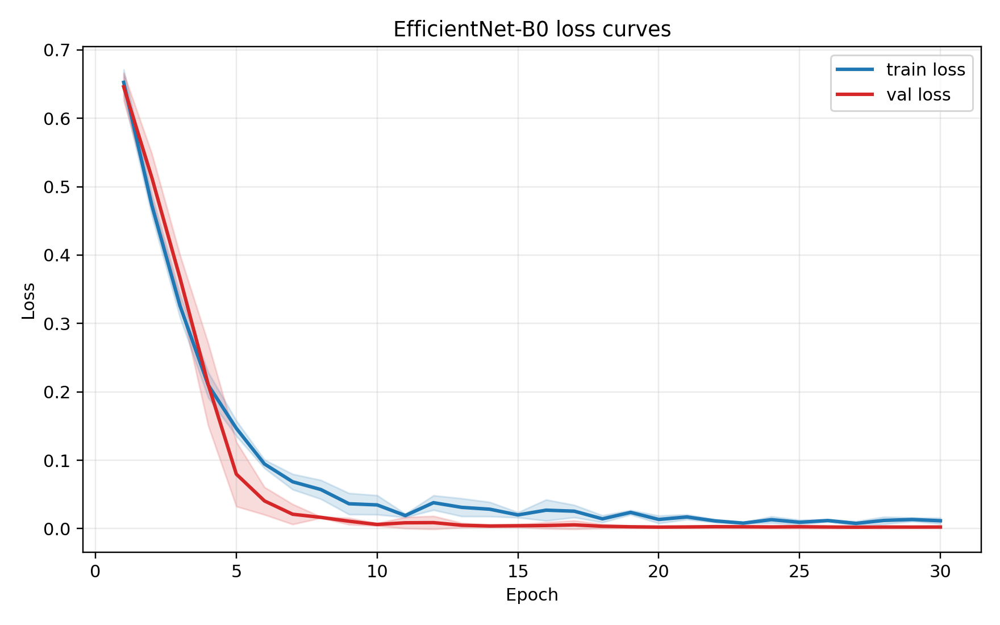

# 超声图像脂肪肝二分类实验报告

## 1. 任务说明

本实验完成超声图像脂肪肝二分类任务。任务目标是根据 B-mode 肝脏超声图像判断样本属于正常肝脏或脂肪肝。

实验要求如下：

- 使用 `Fatty-Liver-public` 文件夹中的公开数据作为训练集和验证集，并按 8:2 随机划分。
- 使用 `Fatty-Liver-private-test` 文件夹中的数据作为独立测试集。
- 至少训练 3 个分类网络模型。
- 报告各模型网络结构、超参数设置和训练参数。
- 绘制 training loss curve 和 validation loss curve。
- 在独立测试集上比较 Accuracy、Precision、Recall、F1-score 的均值和标准差。
- 将各模型与最优模型进行双边 t 检验，报告 t 值和 p 值。
- 对相同测试图像给出 Grad-CAM 可视化分类解释。
- 说明 AI 大模型辅助使用情况。

## 2. 数据集与划分

公开训练数据来自 Kaggle 数据集 `dataset-of-bmode-fatty-liver-ultrasound-images`。本实验仅将公开数据用于训练集和验证集；老师提供的 `Fatty-Liver-private-test` 仅用于最终独立测试，未上传至公开平台。

类别定义：

| 标签 | 含义 |
|---:|---|
| 0 | 正常肝脏 |
| 1 | 脂肪肝 |

数据划分采用分层随机划分，保证训练集和验证集类别比例基本一致。随机种子为 42。

| 数据集 | 正常 | 脂肪肝 | 总数 |
|---|---:|---:|---:|
| 训练集 | 136 | 304 | 440 |
| 验证集 | 34 | 76 | 110 |
| 独立测试集 | 37 | 66 | 103 |

训练集存在类别不平衡，脂肪肝样本多于正常样本。因此本实验使用加权交叉熵作为损失函数，属于对类别不平衡问题的处理。

## 3. 数据预处理与增强

所有图像统一处理为 3 通道 RGB 输入，以兼容 ImageNet 预训练模型。灰度超声图像通过复制通道转换为 RGB。

输入尺寸统一为 $224 \times 224$。

训练集增强策略：

| 操作 | 参数 |
|---|---|
| Resize | $224 \times 224$ |
| RandomHorizontalFlip | $p = 0.5$ |
| RandomRotation | $\pm 10^\circ$ |
| ColorJitter | brightness = 0.12, contrast = 0.12 |
| Normalize | ImageNet mean/std |

验证集和测试集仅执行 Resize、ToTensor 和 Normalize，不使用随机增强。

归一化参数：

| 通道 | mean | std |
|---|---:|---:|
| R | 0.485 | 0.229 |
| G | 0.456 | 0.224 |
| B | 0.406 | 0.225 |

## 4. 模型设置

本实验训练 3 个分类网络：

1. ResNet18
2. MobileNetV3-Small
3. EfficientNet-B0

所有模型均使用 ImageNet 预训练权重，并将最后分类层替换为 2 分类输出层。

### 4.1 ResNet18

ResNet18 使用残差连接缓解深层网络训练中的梯度退化问题。其主体由 BasicBlock 组成，每个 BasicBlock 包含卷积、BN、ReLU 和 shortcut 分支。

网络拓扑图：

结构概述：

| 阶段 | 输出通道 | 说明 |
|---|---:|---|
| Conv stem | 64 | $7 \times 7$ 卷积，stride = 2 |
| MaxPool | 64 | $3 \times 3$ 最大池化 |
| Layer1 | 64 | BasicBlock × 2 |
| Layer2 | 128 | BasicBlock × 2，下采样 |
| Layer3 | 256 | BasicBlock × 2，下采样 |
| Layer4 | 512 | BasicBlock × 2，下采样 |
| Global Average Pooling | 512 | 全局平均池化 |
| FC | 2 | 二分类输出 |

### 4.2 MobileNetV3-Small

MobileNetV3-Small 是轻量级 CNN，核心结构包括 inverted residual block、depthwise separable convolution、Squeeze-and-Excitation 和 Hardswish 激活。该模型参数量小，适合医学图像小数据集上的快速训练和部署。

网络拓扑图：

结构概述：

| 阶段 | 说明 |
|---|---|
| Conv stem | 初始卷积提取低级特征 |
| Inverted residual blocks | 使用 depthwise separable convolution 降低计算量 |
| SE module | 对通道特征进行自适应重标定 |
| Conv head | 高层语义特征整合 |
| Global Average Pooling | 空间维度压缩 |
| Classifier | 输出 2 类预测 |

### 4.3 EfficientNet-B0

EfficientNet-B0 使用 compound scaling 思路，在网络深度、宽度和分辨率之间进行平衡。其基本模块为 MBConv，并引入 Squeeze-and-Excitation 结构。

网络拓扑图：

结构概述：

| 阶段 | 说明 |
|---|---|
| Conv stem | 初始卷积，提取基础纹理特征 |
| MBConv1 | 低层特征提取 |
| MBConv6 stages | 多阶段通道扩展与下采样 |
| SE module | 通道注意力 |
| Conv head | 高层特征整合 |
| Global Average Pooling | 空间聚合 |
| Classifier | 输出 2 类预测 |

## 5. 损失函数与超参数

### 5.1 损失函数

本实验使用加权交叉熵损失函数，以处理训练集中正常样本和脂肪肝样本数量不平衡的问题。

加权交叉熵定义为：

$$
L = - \sum_{c=1}^{C} w_{c} y_{c} \log(p_{c})
$$

其中，$C = 2$，$w_{c}$ 为类别权重，$y_{c}$ 为真实标签的 one-hot 编码，$p_{c}$ 为模型预测概率。

类别权重根据训练集样本数自动计算：

$$
w_{c} = \frac{N}{C \cdot N_{c}}
$$

训练集中：

- 正常类样本数 $N_{0} = 136$
- 脂肪肝样本数 $N_{1} = 304$
- 总样本数 $N = 440$

因此：

| 类别 | 样本数 | 权重 |
|---|---:|---:|
| 正常 | 136 | 1.6176 |
| 脂肪肝 | 304 | 0.7237 |

### 5.2 训练超参数

| 参数 | 设置 |
|---|---|
| 输入尺寸 | $224 \times 224$ |
| Batch size | 32 |
| Epochs | 30 |
| 随机种子 | 42, 43, 44 |
| 优化器 | AdamW |
| 初始学习率 | 0.0001 |
| Weight decay | 0.0001 |
| 学习率衰减 | CosineAnnealingLR |
| Scheduler 参数 | `T_max = 30` |
| 损失函数 | Weighted Cross Entropy |
| 预训练权重 | ImageNet |
| DataLoader workers | 4 |

## 6. 实验环境

| 项目 | 配置 |
|---|---|
| 服务器 | AutoDL |
| GPU | NVIDIA GeForce RTX 4090 |
| 显存 | 24 GB |
| Python | 3.12 |
| PyTorch | 2.8.0+cu128 |
| torchvision | 0.23.0+cu128 |
| CUDA | 可用 |
| 主要依赖 | numpy, pandas, scikit-learn, scipy, tensorboard, matplotlib, opencv-python-headless |

## 7. 评价指标

独立测试集评价指标包括 Accuracy、Precision、Recall 和 F1-score。

设 TP、TN、FP、FN 分别表示真正例、真反例、假正例和假反例。

Accuracy：

$$
Accuracy = \frac{TP + TN}{TP + TN + FP + FN}
$$

Precision：

$$
Precision = \frac{TP}{TP + FP}
$$

Recall：

$$
Recall = \frac{TP}{TP + FN}
$$

F1-score：

$$
F1 = \frac{2 \cdot Precision \cdot Recall}{Precision + Recall}
$$

每个模型使用 3 个随机种子重复训练，最终报告测试集指标的均值和标准差。

## 8. 训练过程 Loss 曲线

所有模型训练过程中均记录 training loss 和 validation loss。每个模型的曲线为 3 个随机种子结果的均值，阴影区域表示标准差。

总体 loss 曲线：

ResNet18：

MobileNetV3-Small：

EfficientNet-B0：

从训练过程看，三个模型在训练集和验证集上均能收敛。其中 ResNet18 和 EfficientNet-B0 在验证集上很快达到接近 1.0 的分类表现，但在独立测试集上性能明显下降，说明公开数据和私有测试集之间存在域偏移。

## 9. 独立测试集结果

### 9.1 每个模型的均值和标准差

独立测试集结果如下。均值和标准差基于 3 个随机种子计算。

| 模型 | Accuracy | Precision | Recall | F1-score |
|---|---:|---:|---:|---:|
| MobileNetV3-Small | 0.5534 ± 0.0846 | 0.7721 ± 0.0311 | 0.4343 ± 0.2012 | 0.5377 ± 0.1490 |
| ResNet18 | 0.4854 ± 0.0700 | 0.8155 ± 0.0247 | 0.2525 ± 0.1306 | 0.3743 ± 0.1523 |
| EfficientNet-B0 | 0.4628 ± 0.0297 | 0.8009 ± 0.0289 | 0.2172 ± 0.0683 | 0.3373 ± 0.0830 |

按平均 F1-score 排序，MobileNetV3-Small 为最优模型。

### 9.2 单次实验结果

| Run | Accuracy | Precision | Recall | F1-score |
|---|---:|---:|---:|---:|
| `efficientnet_b0_seed42` | 0.4951 | 0.7917 | 0.2879 | 0.4222 |
| `efficientnet_b0_seed43` | 0.4369 | 0.8333 | 0.1515 | 0.2564 |
| `efficientnet_b0_seed44` | 0.4563 | 0.7778 | 0.2121 | 0.3333 |
| `mobilenet_v3_small_seed42` | 0.6505 | 0.7586 | 0.6667 | 0.7097 |
| `mobilenet_v3_small_seed43` | 0.5146 | 0.8077 | 0.3182 | 0.4565 |
| `mobilenet_v3_small_seed44` | 0.4951 | 0.7500 | 0.3182 | 0.4468 |
| `resnet18_seed42` | 0.5631 | 0.8387 | 0.3939 | 0.5361 |
| `resnet18_seed43` | 0.4272 | 0.8182 | 0.1364 | 0.2338 |
| `resnet18_seed44` | 0.4660 | 0.7895 | 0.2273 | 0.3529 |

### 9.3 结果分析

MobileNetV3-Small 的平均 F1-score 最高，主要原因是其 Recall 明显高于 ResNet18 和 EfficientNet-B0。ResNet18 和 EfficientNet-B0 的 Precision 较高，但 Recall 较低，说明它们更倾向于预测正常类，导致较多脂肪肝样本被漏判。

测试集性能低于验证集，主要原因可能包括：

- 私有测试集与公开训练数据来源不同，存在域偏移。
- 私有测试图像尺寸、成像质量、灰度分布和采集条件与公开数据不同。
- 数据集规模较小，模型容易在公开训练/验证集上过拟合。
- 正负样本不均衡使模型对少数类和域外样本更敏感。

因此，本实验的重点不是追求验证集高分，而是使用独立测试集评估模型泛化能力。

## 10. 双边 t 检验

以平均 F1-score 最高的 MobileNetV3-Small 作为最优模型。对 3 个随机种子下的测试集指标进行配对双边 t 检验。

### 10.1 F1-score t 检验

| 最优模型 | 对比模型 | t 值 | p 值 |
|---|---|---:|---:|
| MobileNetV3-Small | ResNet18 | 4.3512 | 0.0490 |
| MobileNetV3-Small | EfficientNet-B0 | 3.9891 | 0.0575 |

### 10.2 全指标 t 检验

| 对比模型 | Accuracy t / p | Precision t / p | Recall t / p | F1 t / p |
|---|---:|---:|---:|---:|
| ResNet18 | 3.5000 / 0.0728 | -2.1477 / 0.1648 | 3.4641 / 0.0742 | 4.3512 / 0.0490 |
| EfficientNet-B0 | 2.6458 / 0.1181 | -13.0982 / 0.0058 | 2.6266 / 0.1195 | 3.9891 / 0.0575 |

根据 F1-score 的 t 检验结果：

- MobileNetV3-Small 相比 ResNet18 的 F1-score 提升达到统计显著水平，$p = 0.0490 < 0.05$。
- MobileNetV3-Small 相比 EfficientNet-B0 的 F1-score 提升接近显著，$p = 0.0575$。

需要说明的是，每个模型仅重复 3 个随机种子，样本量较小，因此 t 检验结果应作为辅助统计证据，而不是唯一判断依据。

## 11. Grad-CAM 可视化解释

本实验对 3 个模型在同一批测试图像上生成 Grad-CAM 可视化结果。每张可视化图左侧为原始图像，右侧为 Grad-CAM 热力图叠加结果。热力区域表示模型对脂肪肝分类更关注的图像区域。

### 11.1 测试图像 0

| 模型 | Grad-CAM |
|---|---|
| MobileNetV3-Small |  |
| ResNet18 |  |
| EfficientNet-B0 |  |

### 11.2 测试图像 1

| 模型 | Grad-CAM |
|---|---|
| MobileNetV3-Small |  |
| ResNet18 |  |
| EfficientNet-B0 |  |

### 11.3 测试图像 2

| 模型 | Grad-CAM |
|---|---|
| MobileNetV3-Small |  |
| ResNet18 |  |
| EfficientNet-B0 |  |

从可视化结果看，模型主要关注肝实质区域及局部高响应纹理区域。部分错误预测样本中，热力图可能集中在图像边缘、暗区或非典型纹理区域，提示模型仍可能受到数据域差异和背景伪特征影响。

## 12. 附加题：类别不平衡处理

本实验采用加权交叉熵处理训练集类别不平衡问题。正常类样本较少，因此其损失权重更高；脂肪肝类样本较多，因此其损失权重较低。

该方法的优点是实现简单，能直接嵌入交叉熵损失函数，不需要额外生成合成样本。相比 SMOTE，医学图像任务中直接在图像空间或特征空间合成样本可能引入伪影，因此本实验选择加权损失作为更稳妥的类别不平衡处理方法。

## 13. 结论

本实验完成了超声图像脂肪肝二分类任务，并比较了 ResNet18、MobileNetV3-Small 和 EfficientNet-B0 三种分类网络。

主要结论：

- MobileNetV3-Small 在独立测试集上取得最高平均 F1-score，为 0.5377 ± 0.1490。
- ResNet18 和 EfficientNet-B0 的 Precision 较高，但 Recall 明显偏低，说明漏判脂肪肝样本较多。
- MobileNetV3-Small 相比 ResNet18 的 F1-score 提升具有统计显著性，$t = 4.3512$，$p = 0.0490$。
- MobileNetV3-Small 相比 EfficientNet-B0 的 F1-score 提升接近显著，$t = 3.9891$，$p = 0.0575$。
- 训练/验证集表现明显优于独立测试集，说明公开数据与私有测试集之间存在域偏移。
- Grad-CAM 可视化显示模型能关注部分肝实质区域，但在错误样本中仍可能受到背景或局部伪特征影响。

综合测试集性能和模型复杂度，MobileNetV3-Small 是本实验中最优模型。

## 14. GitHub 项目地址与公开说明

本实验的代码和非敏感结果文件已上传至 GitHub：

<https://github.com/pangchip14/fatty-liver-ultrasound-classification>

该仓库用于保存本实验的可复现代码、模型训练脚本、测试评估脚本、统计检验脚本、网络拓扑图、loss 曲线、汇总指标和报告文件。仓库中包含的主要内容如下：

| 内容 | 说明 |
|---|---|
| `train.py` | 训练 ResNet18、MobileNetV3-Small 和 EfficientNet-B0 |
| `evaluate.py` | 在独立测试集上计算 Accuracy、Precision、Recall 和 F1-score |
| `gradcam.py` | 生成 Grad-CAM 分类解释图 |
| `summarize_results.py` | 汇总不同模型和随机种子的测试结果，并进行 t 检验 |
| `export_report_assets.py` | 导出报告所需的 loss 曲线、网络拓扑图和实验说明 |
| `summary/` | 保存非敏感的汇总指标、loss 曲线和网络拓扑图 |
| `脂肪肝二分类实验报告.md` | Markdown 版实验报告 |
| `脂肪肝二分类实验报告.pdf` | PDF 版实验报告 |

由于 `Fatty-Liver-private-test` 是老师提供的私有测试集，不具备公开授权，因此 GitHub 仓库中未上传以下内容：

- 原始数据集压缩包。
- 解压后的训练、验证和测试图像。
- 私有测试集图像。
- 模型 checkpoint 权重文件。
- 包含私有测试图像内容的 Grad-CAM 可视化图片。
- 打包结果压缩文件。

因此，该 GitHub 仓库主要用于代码复现和实验结果核查，不用于公开分发数据集。

## 15. AI 大模型使用说明

本实验使用 OpenAI Codex / GPT-5 作为 AI 编程与实验辅助工具。AI 主要参与以下工作：

- 分析作业要求并比较不同选题的可行性。
- 检查本地数据集结构，确认公开数据和私有测试集路径。
- 搭建 PyTorch 训练、验证、测试、t 检验和 Grad-CAM 可视化代码。
- 在 AutoDL RTX 4090 服务器上配置环境并运行实验。
- 整理实验输出，包括 loss 曲线、模型拓扑图、测试指标表和统计检验结果。
- 辅助撰写本 Markdown 实验报告。

AI 工具仅用于代码实现、实验组织和文本整理。实验方案选择、结果核查和最终报告内容由本人负责确认。

## 16. 附录：结果文件

主要结果文件如下：

| 文件 | 内容 |
|---|---|
| `summary/test_metrics_by_model.csv` | 3 个模型测试集均值和标准差 |
| `summary/test_metrics_by_run.csv` | 每个模型每个 seed 的测试结果 |
| `summary/paired_t_tests_by_seed.csv` | 基于 3 个 seed 的双边 t 检验 |
| `summary/loss_curves/` | training loss 和 validation loss 曲线 |
| `summary/topologies/` | 3 个模型网络拓扑图 |
| `summary/gradcam/` | 本地保存的同一批测试图像 Grad-CAM 可视化，因包含私有测试图像内容，未上传 GitHub |
| `summary/fatty_liver_results_summary.tar.gz` | 本地汇总打包文件，未上传 GitHub |
